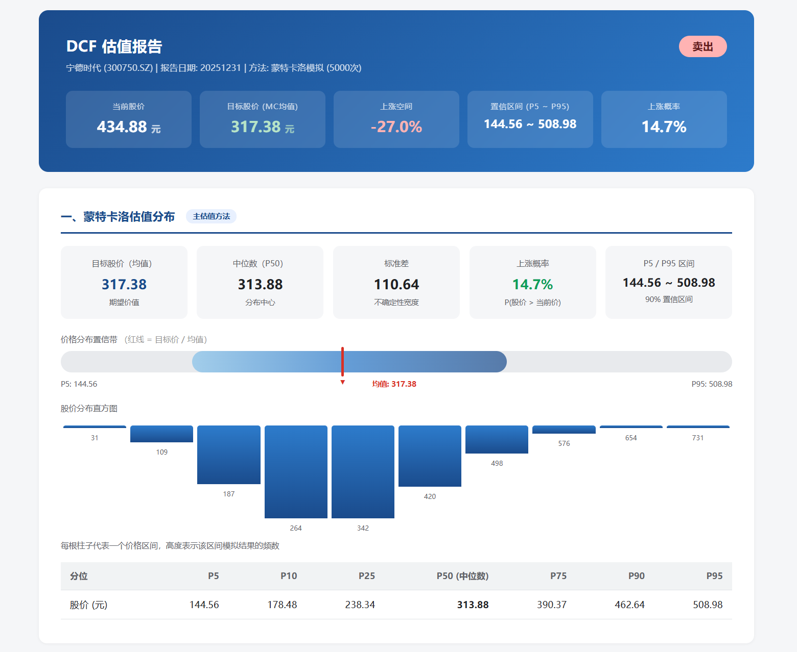

# DCF 估值报告系统

基于蒙特卡洛模拟的两阶段 FCFF 贴现模型，为 A 股上市公司提供自动化估值分析。

## 核心特性

- **蒙特卡洛模拟为主估值方法** — 不是给一组假设算一个"精确"数字，而是对 5 个关键驱动因子赋予概率分布，运行 5000 次模拟得到股价的概率分布
- **组件化 FCFF 拆解** — 从收入增长出发逐项重建 FCFF，而非直接外推历史 FCFF
- **可视化报告** — 生成包含置信带、分布直方图、敏感性分析的 HTML 报告
- **数据驱动** — 通过 Tushare API 自动获取真实财报和行情数据

## 快速开始

### 安装依赖

```bash
pip install tushare pandas numpy pyyaml
```

### 运行估值

```bash
python main.py --ts_code 000858.SZ --token YOUR_TUSHARE_TOKEN
```

输出 HTML 和 Markdown 报告到 `report/` 目录。

### 可选参数

| 参数 | 说明 | 默认值 |
|------|------|--------|
| `--ts_code` | 股票代码（必填），如 600519.SH | — |
| `--token` | Tushare API token | 内置测试 token |
| `--format` | 输出格式: html / md / both | both |
| `--output` | 自定义输出路径 | 自动生成 |
| `--config` | 假设参数配置文件 | config/assumptions.yaml |

### 示例

```bash
# 贵州茅台
python main.py --ts_code 600519.SH --format html

# 格力电器，输出 Markdown
python main.py --ts_code 000651.SZ --format md --output report/gree.md

# 宁德时代，自定义配置
python main.py --ts_code 300750.SZ --config my_params.yaml
```

## 算法概要
### 核心思想
传统 DCF 的问题：给一组固定假设 → 算一条路径 → 得出一个"精确"的数字。

本模型的做法：**通过蒙特卡洛模拟，得到路径，进而得到估值**。

```
不是：增长率 = 10% → FCFF = 412亿 × 1.1^t
而是：增长率 ~ 三角分布(min=2%, mode=10%, max=20%)
      → 每次模拟从分布中随机抽一个值
      → 5000 次模拟 = 5000 条可能的 FCFF 路径
      → 5000 个股价构成分布
      → 均值 = 目标股价
```

### FCFF 拆解

不拿历史 FCFF 直接外推，每一轮模拟从收入增长开始逐项重建：

```
Revenue_t     = 基期收入 × (1 + 增长率)^t
EBIT_t        = Revenue_t × 营业利润率
FCFF_t        = EBIT_t × (1 - 税率) + D&A_t - CapEx_t - ΔWC_t
```

### 5 个随机驱动因子

| 参数 | 分布 | 说明 |
|------|------|------|
| 收入增长率 | 三角分布(min=2%, mode=配置值, max=20%) | 短期增长不确定 |
| 营业利润率 | 正态分布(mean=历史利润率, std=2%) | 盈利波动 |
| D&A/收入比 | 三角分布(2%, 5%, 10%) | 折旧摊销 |
| CapEx/收入比 | 三角分布(2%, 6%, 15%) | 资本支出 |
| WC/收入比 | 三角分布(0%, 3%, 8%) | 营运资本需求 |

### 两阶段模型

- **阶段 I（显式预测期）**：5 年，逐年拆解 FCFF 并贴现
- **阶段 II（终值）**：永续增长模型，`TV = FCFF_n × (1 + g) / (WACC - g)`

### WACC（CAPM）

```
Ke = Rf + β × ERP
Kd = Rf + 信用利差
WACC = We × Ke + Wd × Kd × (1 - T)
```
每一轮模拟的完整计算链：

```
                        ┌─ 增长率 ─┐
  基期收入 ───────────→ Revenue_t ─→ EBIT_t ─┐
                        ├─ D&A%   ─→ D&A_t   ├→ FCFF_t ─→ TV
                        ├─ CapEx% ─→ CapEx_t ┘          └→ PV(FCFF) + PV(TV) = EV
                        └─ WC%    ─→ ΔWC_t                     ↓
                                                    EV - 债务 + 现金 = 股权价值
                                                             ↓
                                                      股权价值 / 总股本 = 每股价格
```
## 

```
5000 次重复 → 5000 个股价 → 分布统计：
                            │
              ┌──────────────┼──────────────┐
              ↓              ↓              ↓
         均值=目标价    P5/P95=90%区间  上涨概率
```

| 输出                   | 含义                         |
| ---------------------- | ---------------------------- |
| 均值 197.90 元         | **目标股价**，所有模拟的平均 |
| 中位数 194.81 元       | 分布中心，接近均值→分布对称  |
| P5 149.29 / P95 255.44 | 90% 概率股价落在此区间       |
| 标准差 32.60           | 不确定性宽度                 |
| 上涨概率 100%          | 模拟中股价超过当前价的比例   |

## 项目结构

```
dcf/
├── main.py                      # CLI 入口
├── config/
│   └── assumptions.yaml         # 全局假设参数
├── data/
│   ├── tushare_client.py        # Tushare API 封装
│   └── fetch_financials.py      # 财务数据获取与标准化
├── models/
│   ├── wacc.py                  # WACC 计算 (CAPM)
│   ├── dcf_model.py             # 两阶段 DCF 模型
│   └── monte_carlo.py           # 蒙特卡洛模拟引擎
├── analysis/
│   └── sensitivity.py           # 敏感性 & 情景分析
├── report/
│   ├── generator.py             # HTML / Markdown 报告生成
│   └── template.html            # HTML 报告模板
├── temp/						 # 输出的部分dcf估值报告 html格式
└── 算法说明文档.md                # 算法详细说明
```

## 报告内容

生成的 HTML 报告包含：

1. **估值概要** — 当前价、目标价（MC 均值）、上涨空间、置信区间、上涨概率
2. **蒙特卡洛估值分布** — 分布直方图、置信带可视化、百分位表
3. **WACC 计算明细** — 各参数数值及简要解释



## 依赖

| 包 | 用途 |
|---|------|
| tushare | A 股金融数据 API |
| pandas | 数据处理 |
| numpy | 数值计算、随机采样 |
| pyyaml | 配置文件解析 |

## 数据来源

通过 [Tushare Pro](https://tushare.pro/) 获取：
- 利润表、资产负债表、现金流量表
- 日线行情、每日指标（市值/PE/PB）
- 财务指标（ROE/EPS/BPS）
- 股票基础信息

## 局限性

- DCF 模型不适用于金融行业（银行/保险/券商）
- FCFF 持续为负的公司会导致估值失真
- 模型假设依赖用户配置，不同参数组合结果差异较大
- 当前 Beta 为固定配置值，未作历史回测
